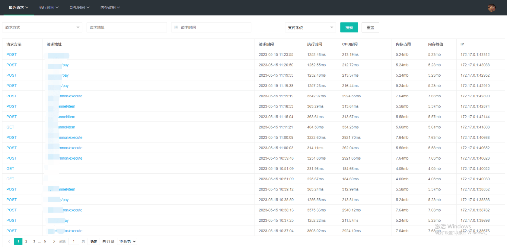
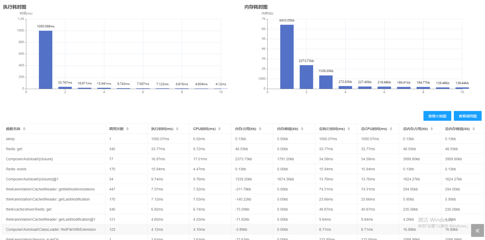
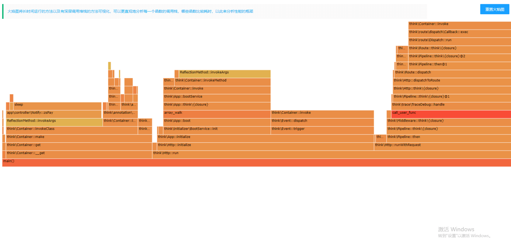
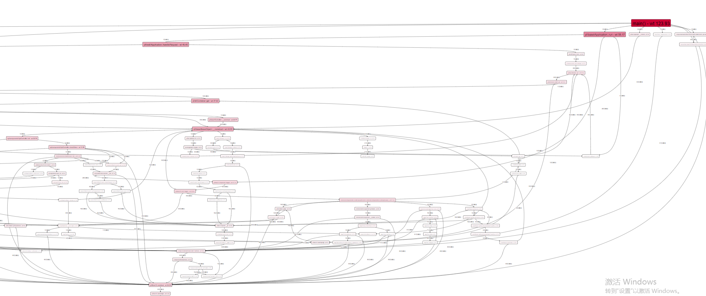

### 项目介绍

用户PHP-FPM性能观测，只适用于常规项目，swoole框架的项目禁止使用。






### 部署文档

- 项目依赖
```shell
php>=7.2

mongodb>=1.13

tideways_xhprof:https://github.com/tideways/php-xhprof-extension
```

- 安装依赖

```shell
composer install
```

- 配置环境
```shell
APP_DEBUG = false

[APP]
DEFAULT_TIMEZONE = Asia/Shanghai


[LANG]
default_lang = zh-cn

[MONGO]
HOSTNAME=
HOSTPORT=
DATABASE=xhprof
USERNAME=
PASSWORD=
```

- nginx配置

```shell
location / {
  server_name your-domain.com
   if (!-e $request_filename) {
   		rewrite  ^(.*)$  /index.php?s=/$1  last;
    }
}

location ~ \.php$ {
	fastcgi_pass   127.0.0.1:9000;
	fastcgi_index  index.php;
	fastcgi_param  SCRIPT_FILENAME  $document_root$fastcgi_script_name;
	# 预加载文件，使用绝对路径
	fastcgi_param PHP_VALUE "auto_prepend_file=/your/path/profile-gui/extend/capture.php";
	include        fastcgi_params;
}
}
```

- 项目映射
> 主要是使用不同的目录来区分捕获的数据该写入那个mongo的集合中

在config/profile.php文件中添加配置
```shell
   // 项目映射
    "project"   => [
        "/var/www/html/test/public" => ["title" => "测试系统", "id" => "test", "rate" => 0.8],
    ],
    "platform"  => [
        ["title" => "测试系统", "id" => "test"],
    ]
```


- mongo
> 使用mongo命令行或其他方式创建数据库、集合、索引

```shell
$ /usr/local/mongodb/bin/mongo
# 创建数据库
> use xhprof
# 创建集合并加索引，有多少集合就需要每个集合单独创建索引
db.test.ensureIndex( { 'meta.SERVER.REQUEST_TIME' : -1 } )  
db.test.ensureIndex( { 'profile.main().wt' : -1 } )  
db.test.ensureIndex( { 'profile.main().mu' : -1 } )  
db.test.ensureIndex( { 'profile.main().cpu' : -1 } )  
db.test.ensureIndex( { 'meta.url' : 1 } )
```

#### 设置

- 设置采样率
> 设置默认采样率为0.8

```shell
"/var/www/html/test/public" => ["title" => "测试系统", "id" => "test", "rate" => 0.8],
```


